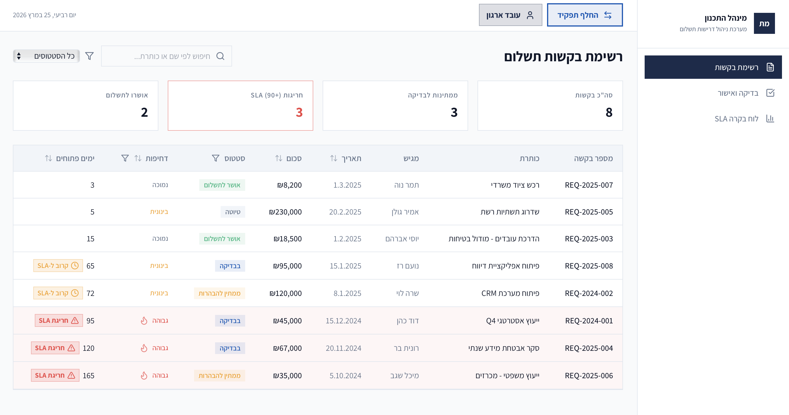

# מערכת ניהול דרישות תשלום – אב-טיפוס (iPlan Vibe Coding Challenge)
**מוגש עבור: מינהל התכנון – אגף בכיר טכנולוגיות דיגיטליות ומידע**

### 🔗 [Live Demo - View the Application](https://payments-management-michelle.lovable.app)

   

## 📊 סקירה כללית
אב-טיפוס למערכת Web מתקדמת המיועדת להסדרה, אוטומציה ושקיפות בתהליכי הגשת ואישור דרישות תשלום של יועצים חיצוניים. המערכת מחליפה תהליכים ידניים בממשק דיגיטלי מובנה המאפשר מעקב הדוק אחר לוחות זמנים (SLA) ובקרת תקציב ארגונית.

## 🧠 לוגיקה אנליטית וניהול סיכונים (Data Science Focus)
כחלק מהפיכת המערכת לכלי תומך החלטות (Decision Support System), הוטמע מנוע לדירוג סיכונים המבוסס על עקרונות של **Feature Engineering** ונירמול נתונים. במקום להסתמך על חיווי ויזואלי פשוט, המערכת מחשבת מדד סיכון משוקלל לכל בקשה.

### מודל דירוג הסיכונים (Weighted Risk Model)
המדד מבוסס על שקלול ליניארי של שני משתנים קריטיים: סכום הדרישה וזמן ההמתנה בטיפול (SLA). כדי למנוע הטיות (Bias) הנובעות מסדרי גודל שונים, בוצע נירמול בשיטת **Min-Max Scaling** לטווח של $[0, 1]$.

הנוסחה המתמטית המיושמת בקוד (`src/lib/utils.ts`):
$$RiskScore = (w_1 \cdot \hat{A} + w_2 \cdot \hat{D}) \cdot 100$$

כאשר:
* $\hat{A} = \min(\frac{\text{Amount}}{50,000}, 1)$ - סכום מנורמל (עם חסם עליון של 50,000 ש"ח).
* $\hat{D} = \min(\frac{\text{Days Pending}}{90}, 1)$ - זמן המתנה מנורמל ביחס ליעד ה-SLA.
* $w_1 = 0.4, w_2 = 0.6$ - משקולות שנקבעו מתוך תעדוף תפעולי של זמן טיפול על פני גודל תקציבי.

## ✨ תכונות מרכזיות וחווית משתמש (UX)
* **ניהול הרשאות מבוסס תפקיד (RBAC):** הפרדה מלאה בין ממשק היועץ לממשק הארגוני.
* **ניטור SLA חכם:** מערכת חיווי ויזואלית המתריעה על בקשות שחורגות מ-90 ימי טיפול.
* **וולידציה ותקינות נתונים:** מנגנון מובנה למניעת הזנת ערכים שליליים ומשוב מיידי בעברית (Toast).

## 🛠 לוגיקה עסקית ומקרי קיצון
* **ניווט וסינון דו-שכבתי (Dual-Layer Filtering):** חיפוש גלובלי לצד סינון ומיון גרנולרי בכל עמודה.
* **סגירת מעגל תפעולי (Clarification Loop):** אפשרות להחזרת בקשה להבהרות ושמירה על רצף התהליך מבלי לפתוח פניות כפולות.
* **שקיפות בדחייה:** חובת פירוט סיבת דחייה להבטחת שקיפות מול ספקים.

## 🚀 היבטים טכנולוגיים
* פיתוח ב-**React** ו-**TypeScript** עם דגש על **Type Safety**.
* שימוש ב-**TailwindCSS** ורכיבי **Shadcn/UI** לממשק מודרני ונגיש.
* תמיכה מלאה ב-**RTL** (עברית).
